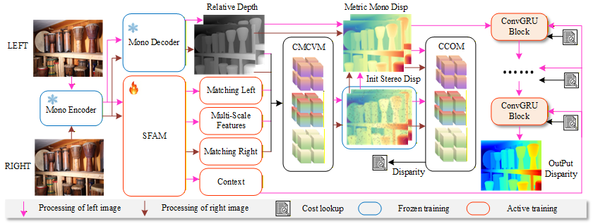

# MFGStereo



##  🌼 Abstract
Stereo matching is a fundamental task in computer vision and robotics. Despite remarkable progress over the past decade, addressing ill-posed regions such as reflective surfaces and textureless areas remains an open challenge. This issue is largely attributed to the inherent matching ambiguity, which leads to local optima results. In this work, we introduce a novel framework that leverages the general representations from monocular foundation models to guide stereo matching in resolving these inherent ambiguities. Specifically, we first introduce a Stereo Feature Adaptation Module (SFAM), which is designed to enhance both discrepant and the contextual features of stereo pipeline by integrating the geometric prior from monocular depth-related features. Subsequently, we replace the traditional single-source cost structure with a novel Cross-Modal Cost Volume Module (CMCVM), which ensures matching stability in ill-posed regions through the complementary of three-source costs: an SFAM-based fixed-range cost, a foundation-based long-range cost and a depth-based gradient discrepancy cost. To further improve the reliability of CMCVM, we introduce a Confidence-based Cost Optimization Mechanism (CCOM) that adaptively filters out the unreliable correlations in illposed regions. Finally, the filtered CMCVM is indexed and processed by ConvGRUs for iterative disparity refinement. The proposed modules effectively leverage monocular guidance to enhance stereo matching, enabling robust performance in ill-posed regions. In the experiments, we integrate the proposed modules into a unified framework, termed MFGStereo. Comprehensive experiments demonstrate that MFGStereo exhibits strong generalization ablily across various scenarios. Moreover, it achieves state-of-the-art results in both the quantification and visualization of challenging ill-posed regions.

## :art: Zero-shot performance on the wild captured stereo images

Zero-shot generalization performance on our captured stereo images.

## ⚙️ Installation
* NVIDIA RTX 4090
* python 3.8

### ⏳ Create a virtual environment and activate it.

```Shell
conda create -n monster python=3.8
conda activate monster
```
### 🎬 Dependencies

```Shell
pip install torch==2.0.1 torchvision==0.15.2 torchaudio==2.0.2 --index-url https://download.pytorch.org/whl/cu118
pip install tqdm
pip install scipy
pip install opencv-python
pip install scikit-image
pip install tensorboard
pip install matplotlib 
pip install timm==0.6.13
pip install mmcv==2.1.0 -f https://download.openmmlab.com/mmcv/dist/cu118/torch2.1/index.html
pip install accelerate==1.0.1
pip install gradio_imageslider
pip install gradio==4.29.0
